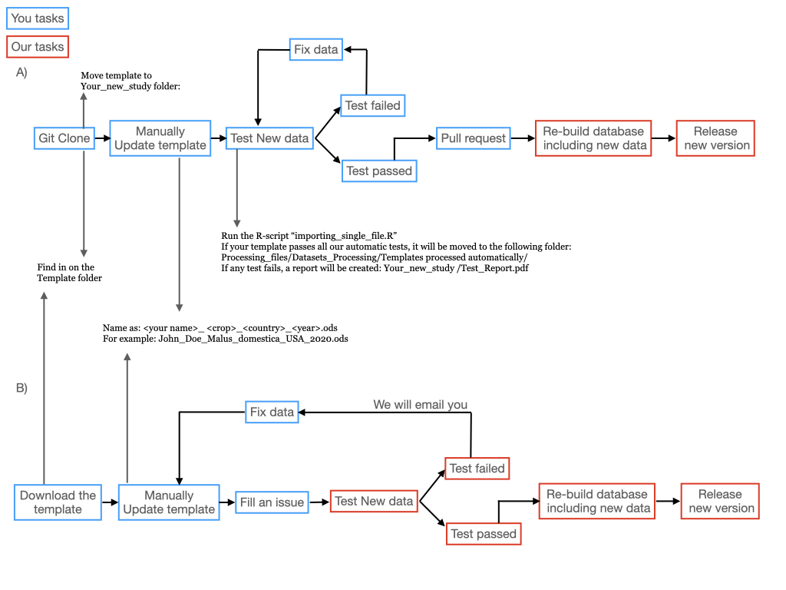

# Crop Pollination Database

## How to use the database:

The database is stored as three `.csv` files you can find in `Final_Data` folder. Here you will find the latest version (See `News.md`). Stable releases can be found in Zenodo: DOI: [10.5281/zenodo.4311291](https://zenodo.org/badge/latestdoi/240485535)

- `CropPol_field_level_data.csv` contains one row per field and study system with summary values per field incuding field coordinates, pollintor richness, yield, etc...
- `CropPol_sampling_data.csv` contains pollinator sampling data on which pollinators where collected per field. 
- `CropPol_data_ownership.csv` contains information on data authors, affiliations and funding.

Please, check Metadata [here](http://htmlpreview.github.io/?https://github.com/ibartomeus/OBservData/blob/master/Metadata/docs/index_Rev.html) and understand the data limitations by reading the data paper: Allen-Perkins et al. (2020) CropPol: a dynamic, open and global database on crop pollination. (In review) [Link to preprint TBA]()

If you want to dig into raw data files, all reproducible data and code to build the database is under the `Processing_files` folder.

## How to cite the database:

Please cite CropPol database when the data are used in bulk in publications and cite individual studies when pertinent. 

- Version 1.1.1 is published as a Data Paper in Ecology: [https://esajournals.onlinelibrary.wiley.com/doi/10.1002/ecy.3614](https://esajournals.onlinelibrary.wiley.com/doi/10.1002/ecy.3614).  

- Bugs are updated in the third digit (e.g. v1.0.1), new datasets in the second digit (e.g. v1.1.0) and major upgrades in the first digit (e.g. v2.0.0). You can see how to cite more recent versions with updated data and contributing authors in: https://github.com/ibartomeus/OBservData/releases and in Zenodo.

## How to contribute?

We encourage you to add new data to this database. If you are github user, just clone the repo, and follow the instrucions in `Your_new_study` folder. When ready, make us a pull request and we will add the new data.

If you are not familiar with github, don't worry, just [download the template](https://github.com/ibartomeus/OBservData/raw/master/Template/Template_example_V9.ods), fill it up and open an [issue](https://github.com/ibartomeus/OBservData/issues/new?assignees=AlfonsoAllen&labels=New+data&template=new-data.md&title=%5Bdata%5D) to let us know where we can access the template.

This is the workflow for github users (A) and non-users (B). 

## Spotted any error?

Please let us know in an [issue](https://github.com/ibartomeus/OBservData/issues/new?assignees=AlfonsoAllen&labels=bug&template=bug_report.md&title=%5Bbug%5D)

### Thanks to:  

We started using livedat **Template Repo** designed to assist in setting up a repository for regularly-updated data. Details in [this PLOS Biology paper](https://doi.org/10.1371/journal.pbio.3000125). Instructions for creating an updating data workflow can be found at this companion website: [UpdatingData.org](https://www.updatingdata.org/).  

